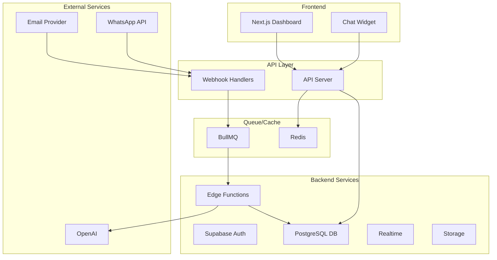

# Zynlo Helpdesk - Architecture Documentation

## 🏗️ System Architecture

### Overview
Zynlo Helpdesk is built as a modern, scalable ticketing system using a microservices architecture with the following key components:



## 📦 Technology Stack

### Frontend
- **Framework**: Next.js 14 (App Router)
- **UI Library**: React 18
- **Styling**: Tailwind CSS
- **Components**: Radix UI (headless)
- **State Management**: Zustand / React Context
- **Data Fetching**: React Query / SWR
- **Forms**: React Hook Form + Zod

### Backend
- **Database**: PostgreSQL (via Supabase)
- **Auth**: Supabase Auth
- **Realtime**: Supabase Realtime
- **API**: Express.js + TypeScript
- **Queue**: BullMQ (Redis)
- **Storage**: Supabase Storage

### Infrastructure
- **Hosting**: Vercel (Frontend) + Railway/Fly.io (API)
- **Database**: Supabase Cloud
- **Monitoring**: Sentry
- **Analytics**: PostHog / Plausible

## 🔄 Data Flow

### 1. Incoming Message Flow
```
External Channel → Webhook → API Server → Queue → Process → Database → Realtime → UI
```

### 2. Outgoing Message Flow
```
UI → API → Database → Queue → Edge Function → External Service
```

### 3. Authentication Flow
```
User → Next.js → Supabase Auth → JWT → API Validation
```

## 🗄️ Database Schema

### Core Tables
- `users` - System users (agents, admins)
- `customers` - Customer profiles
- `teams` - Team organization
- `tickets` - Support tickets
- `conversations` - Communication threads
- `messages` - Individual messages
- `webhook_logs` - Incoming webhook data

### Relationships
```sql
tickets >--< conversations >--< messages
   |              |
   v              v
customers      channels
   |
   v
users --> teams
```

## 🔐 Security Architecture

### Authentication & Authorization
1. **Multi-factor Authentication**: Via Supabase Auth
2. **Role-Based Access Control (RBAC)**: Admin, Agent, Viewer
3. **Row Level Security (RLS)**: Database-level security
4. **API Key Management**: For webhook endpoints

### Data Protection
1. **Encryption at Rest**: PostgreSQL encryption
2. **Encryption in Transit**: TLS 1.3
3. **PII Handling**: GDPR compliant data storage
4. **Audit Logging**: All actions logged

## 🚀 Deployment Architecture

### Development
```yaml
Local Development:
  - Docker Compose for Supabase
  - Hot reload for all services
  - Seed data for testing
```

### Production
```yaml
Production:
  Frontend:
    - Vercel Edge Network
    - Automatic scaling
    - Global CDN
  
  API:
    - Container-based deployment
    - Auto-scaling groups
    - Load balancer
  
  Database:
    - Supabase managed PostgreSQL
    - Point-in-time recovery
    - Read replicas
```

## 📊 Performance Considerations

### Caching Strategy
1. **Redis Cache**: Session data, frequent queries
2. **Edge Caching**: Static assets, API responses
3. **Database Caching**: Query result caching

### Optimization Techniques
1. **Database Indexes**: On foreign keys and search fields
2. **Connection Pooling**: PgBouncer for database
3. **Lazy Loading**: Components and routes
4. **Image Optimization**: Next.js Image component

## 🔄 Scalability Design

### Horizontal Scaling
- Stateless API servers
- Queue-based processing
- Database read replicas
- CDN for static assets

### Vertical Scaling
- Database performance tiers
- Redis cluster mode
- Edge function concurrency

## 🛠️ Development Workflow

### CI/CD Pipeline
```yaml
1. Code Push → GitHub
2. Automated Tests → GitHub Actions
3. Build & Lint → Turbo
4. Deploy Preview → Vercel
5. Production Deploy → Manual approval
```

### Environment Management
- `development` - Local development
- `staging` - Pre-production testing
- `production` - Live environment

## 📈 Monitoring & Observability

### Application Monitoring
- **Error Tracking**: Sentry
- **Performance**: Web Vitals
- **Uptime**: Better Uptime
- **Logs**: Supabase Logs

### Business Metrics
- Response time tracking
- Ticket resolution metrics
- Agent performance
- Customer satisfaction

## 🔌 Integration Points

### Inbound Integrations
- Email (SMTP/IMAP)
- WhatsApp Business API
- Web Chat Widget
- REST API

### Outbound Integrations
- Email sending (Resend)
- SMS notifications
- Slack notifications
- Webhook events

## 🎯 Design Principles

1. **Modularity**: Loosely coupled services
2. **Resilience**: Graceful degradation
3. **Security First**: Defense in depth
4. **Developer Experience**: Clear APIs and documentation
5. **User Experience**: Fast, intuitive interface

## 📚 API Design

### RESTful Endpoints
```
GET    /api/tickets
POST   /api/tickets
GET    /api/tickets/:id
PUT    /api/tickets/:id
DELETE /api/tickets/:id

POST   /api/messages
GET    /api/conversations/:id/messages

POST   /webhooks/email
POST   /webhooks/whatsapp
```

### GraphQL (Future)
```graphql
type Ticket {
  id: ID!
  subject: String!
  status: TicketStatus!
  messages: [Message!]!
  customer: Customer!
}
```

## 🔮 Future Considerations

### Planned Enhancements
1. **AI Integration**: Smart routing, auto-responses
2. **Mobile Apps**: iOS/Android agent apps
3. **Advanced Analytics**: ML-based insights
4. **Multi-tenancy**: White-label solution
5. **Plugin System**: Third-party integrations

### Technical Debt Management
- Regular dependency updates
- Code quality metrics
- Performance budgets
- Security audits

---

This architecture is designed to be scalable, maintainable, and extensible while providing excellent performance and user experience. 